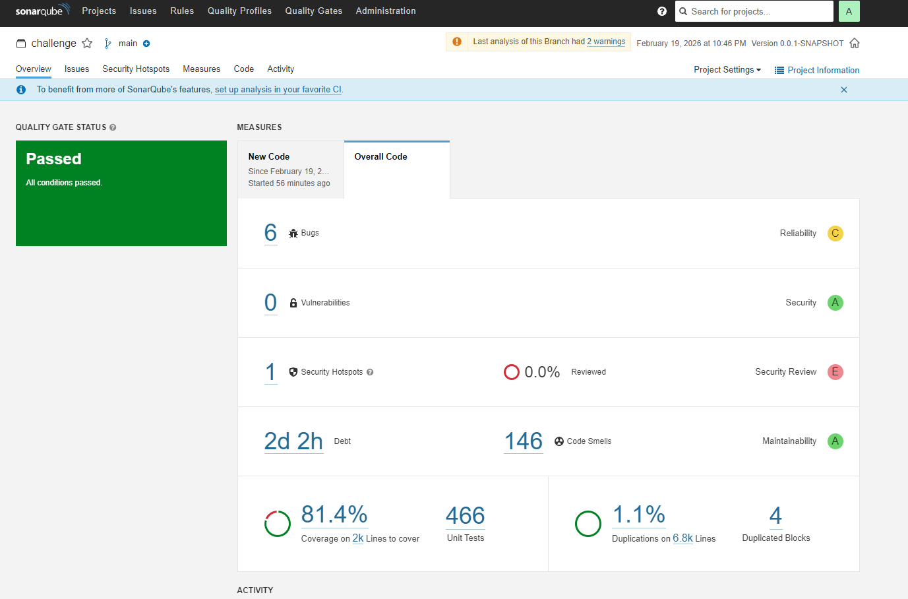

# 📦 application — Deploy on Kubernetes (AWS)

Este repositório contém a aplicação principal (Spring Boot) e os manifests/terraform para deploy em Kubernetes. O conteúdo e instruções foram organizados para atender aos requisitos do Tech Challenge: autenticação via Function Serverless (CPF → JWT), deploy em Kubernetes provisionado por Terraform, integração com API Gateway e pipelines CI/CD separadas.

Resumo do papel deste repositório:
- Código da aplicação: `application/` (serviços, usecases e controllers).
- Infra de aplicação (Kubernetes manifests via Terraform): `application/infra`.
- Artefato Docker + `Dockerfile` e `docker-compose.yml` para desenvolvimento local.
- Workflows de CI: `.github/workflows/ci-cd-app.yml` (build, push, deploy usando outputs do infra).

Principais garantias requeridas pelo desafio:
- Deploy automatizado em Kubernetes (usando os outputs do repositório `infra-kubernetes`).
- Rotas protegidas por autenticação: fluxo de validação CPF é tratado pela Function Serverless (repositório separado) que emite JWTs consumidos por esta aplicação.
- Observabilidade: logs estruturados (JSON) e métricas expostas para scraping.

## Pré-requisitos mínimos
- Docker
- Maven 3.6+
- `kubectl` apontando para o cluster objetivo (EKS provisionado pelo repositório `infra-kubernetes`)
- Terraform (para aplicar `application/infra` quando CI não fizer isso)

## Build, imagem e registry
1. Gerar o artefato:

```bash
mvn -B clean package -DskipTests
# artefato: application/target/*.jar
```


2. Build e push da imagem (Docker Hub):

```bash
# autenticar no Docker Hub
echo "<DOCKERHUB_PASSWORD>" | docker login --username <dockerhub-username> --password-stdin
docker build -t <dockerhub-username>/challengeone:<tag> .
docker push <dockerhub-username>/challengeone:<tag>
```

## Provisionamento e deploy (Terraform)
Os manifests/infra estão em `application/infra`. O deploy desta camada pode ser feito manualmente (local) ou via CI:

```bash
cd application/infra
terraform init
terraform plan 
terraform apply 
```

Antes de rodar, atualize a referência da imagem em `application/infra/deployment_app.tf` para a tag publicada.

Integração com `infra-kubernetes`: a infraestrutura central (cluster, security groups, OIDC/IRSA) é criada no repositório `infra-kubernetes`. Configure o pipeline para consumir os outputs daquele repositório (`cluster_name`, `kubeconfig`/endpoint) em tempo de deploy.

## Autenticação e API Gateway (visão operacional)
- A validação do CPF e emissão de JWTs deve ocorrer numa Function Serverless separada (repositório `challenger-pos`/`lambda-function-serverless`).
- A API Gateway (repositório `challenger-pos`/`gateway`). deve ser configurada para rotear chamadas públicas e proteger rotas sensíveis delegando validação ao JWT gerado pela Function.
- Esta aplicação espera receber requests com `Authorization: Bearer <JWT>` e valida internamente o token (biblioteca JWT). 

## CI/CD e boas práticas
- Branch `main` e `homologation` protegidas: sem commits diretos; uso obrigatório de Pull Requests para merge.
- Deploy automático configurado para branches de homologação e produção via workflows (GitHub Actions). Veja `.github/workflows/ci-cd-app.yml`.
- Secrets e credenciais gerenciadas via GitHub Secrets.

## Swagger
- <URL_do_gateway>/api/swagger

Alternativamente, collection disponível para consumo via gateway no repositório do gateway, em `challenger-pos`/`gateway`

## Arquitetura

Disponível em /documentation.

## Cobertura de testes


